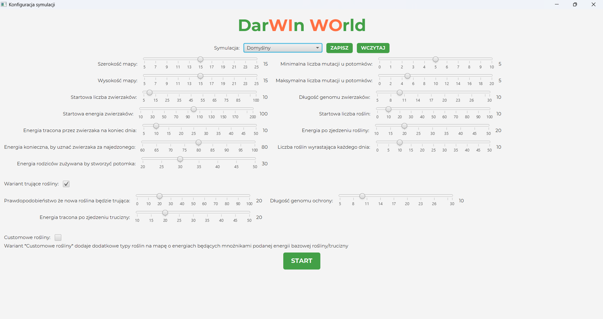
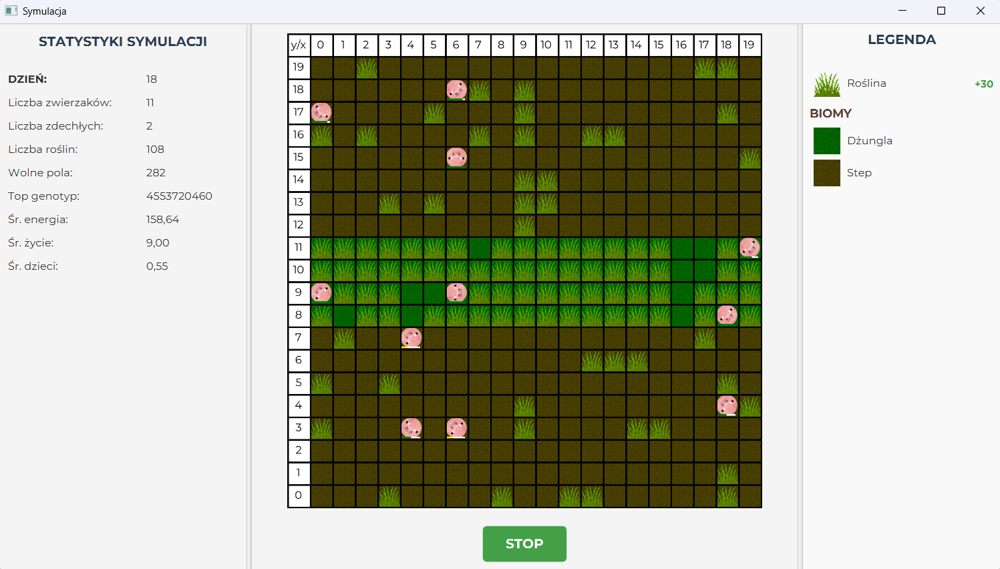
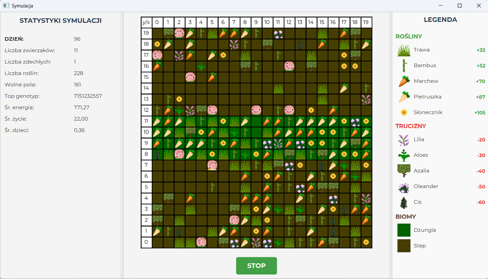

# DarWIn WOrld

**Wariant:** Trucizny i Odporność  
**Autorzy:** Michał Graboś, Jakub Głód  
**Technologie:** Java 21, JavaFX 21, Gradle, JUnit 5

---

## Opis

Symulator ewolucyjny, w którym zwierzęta poruszają się po prostokątnej mapie, jedzą rośliny, rozmnażają się i ewoluują dzięki genomom. Mapa podzielona jest na **dżunglę** (centralny pas, 80% roślin) i **step** (reszta, 20% roślin). Świat jest kulisty -- krawędzie lewo/prawo zawijają się, a na biegunach zwierzę zawraca.

W wariancie **Trucizny i Odporność** rośliny mogą być trujące, a zwierzęta zyskują odporność proporcjonalną do zgodności ich genomu z genomem ochronnym.

---

## Uruchomienie

**Wymagania:** Zainstalowany [JDK 21](https://www.oracle.com/pl/java/technologies/downloads/#java21)
```bash
cd DarWInWOrld
./gradlew build
./gradlew run
```


## Konfiguracja symulacji



## Symulacja



## Symulacja z customowymi roślinami



---

## Architektura

Wzorzec **MVC** z wzorcem **Observer** do aktualizacji GUI.

```
project/
  model/
    coordinates/        Vector2D, Boundary
    map/                WorldMap (interfejs), RectangularMap, MapDirection
    random/             RandomGenerator
    simulation/         Simulation, SimulationApp, SimulationParameters
      statistics/       SimulationStatistics, SimulationStatisticsTracker, StatisticsToFile
    worldelements/      WorldElement (interfejs)
      animals/          Animal, Genome, AnimalComparator, AnimalParameters
      edibleelements/   Plant, Antidote, Poison, TypeOfAntidote, TypeOfPoison, PlantParameters
  presenter/            ConfigurationPresenter, MapPresenter, MapDrafter, PresetService
```

---

## Zrealizowane rozszerzenia

1. **Wiele symulacji jednocześnie** -- osobne okna, osobne wątki
2. **Wizualizacja energii** -- paski energii nad zwierzętami (zielony -> czerwony)
3. **Presety i zapis/odczyt konfiguracji** -- 5 wbudowanych presetów + serializacja do `.properties`
4. **Eksport statystyk do CSV** -- dzienne statystyki zapisywane do `simulationstats/`
5. **Customowe rośliny** -- 10 gatunków z własnymi teksturami i skalowaną energią
---

## Parametry konfiguracji

| Grupa | Parametry |
|-------|-----------|
| Mapa | szerokość, wysokość, początkowe rośliny, nowe rośliny/dzień, początkowe zwierzęta |
| Zwierzęta | energia startowa, dzienna strata, próg rozmnażania, koszt rozmnażania, min/max mutacji, długość genomu |
| Rośliny | energia bazowa, % trucizn, strata od trucizn |
| Warianty | trucizny wł/wył, customowe rośliny wł/wył, długość genomu ochronnego |

---

## Testy

9 klas testowych: `AnimalTest`, `GenomeTest`, `RectangularMapTest`, `SimulationTest`, `Vector2DTest`, `MapDirectionTest`, `RandomGeneratorTest`, `AntidoteTest`, `PoisonTest`

```bash
cd DarWInWOrld
./gradlew test
```
